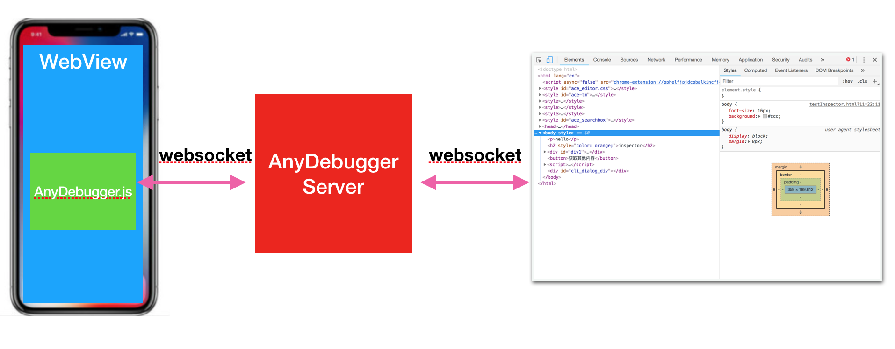
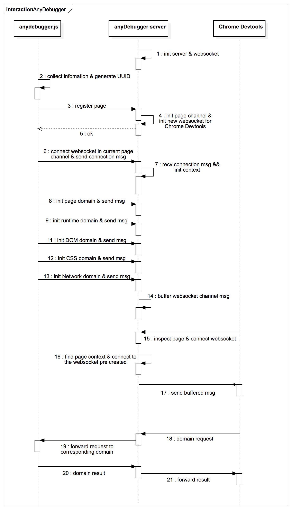

## anydebugger
anydebugger enable you debug you web pages anywhere via Chrome Devtool with Chrome Devtools Protocol supported partially. we will support JavaScript Debug soon!

## usage
```
npm install anydebugger -g

anydebugger -v //see version

anydebugger //start debug

anydebugger -p 9000 //start debug
```
then it will open your default browser antomatically, you can follow the web guide.

## framework


